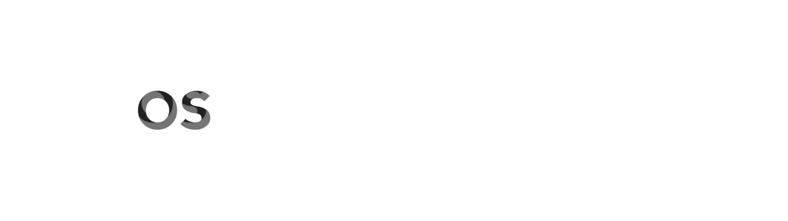

  

  # 🌌 Orbit Station

  **Your Cosmic Bookmark Manager & Collaboration Hub**

  
  
  
  
  
  

    Orbit Station adalah platform manajemen tautan (bookmark) kolaboratif yang didesain layaknya stasiun luar angkasa. Simpan, atur, dan bagikan penemuan internet Anda ke dalam <strong>Sector</strong>, dan berkolaborasilah bersama teman-teman Anda secara <i>real-time</i>!
  

---

## ✨ Fitur Unggulan

### 🔖 Advanced Bookmark Management (Beacons)
- **Auto-Metadata Fetching:** Cukup masukkan URL, dan sistem akan otomatis menarik Title, Deskripsi, Banner (OG Image), dan Favicon dari website tujuan.
- **Sector Organization:** Kelompokkan *beacons* Anda ke dalam folder (Sector) yang rapi, lengkap dengan kustomisasi ikon dan warna.
- **Drag & Drop Reordering:** Atur urutan sektor dengan mudah menggunakan *drag-and-drop*.
- **Smart Fallback System:** Sistem kebal terhadap proteksi *Hotlink/CORS*. Jika gambar banner diblokir, sistem akan otomatis menggunakan Favicon atau inisial domain.

### 🤝 Real-Time Collaboration
- **Multiplayer Mode:** Undang teman (Pilot lain) ke dalam sektor Anda. Setiap penambahan, pengubahan, atau penghapusan *beacon* akan langsung teranimasi di layar semua anggota tanpa perlu *refresh* (Powered by Pusher).
- **Role-Based Access Control:** Tetapkan anggota sebagai `ADMIN` atau `MEMBER` untuk menjaga keamanan sektor Anda.
- **Ownership Transfer:** Sistem aman untuk memindahtangankan kepemilikan sektor ke pengguna lain.

### 💬 Integrated Group Chat & Presence
- **Sector Chat:** Setiap sektor kolaborasi dilengkapi dengan ruang obrolan grup interaktif.
- **Global Presence:** Indikator titik Hijau/Abu-abu *real-time* untuk mengetahui siapa saja anggota yang sedang *online* di dalam aplikasi.
- **Typing Indicators & Read Receipts:** Lihat saat teman Anda sedang mengetik pesan.
- **Smart Mentions:** *Mention* pengguna lain (`@username`), seluruh anggota (`@all`), atau panggil *beacon* spesifik untuk referensi cepat.
- **Admin Commands:** Kendalikan obrolan dengan *slash commands* seperti `/mute:all`, `/kick:username`, `/blind:username`, dan `/clear`.

### 🔔 Native Notifications
- **In-App Toasts:** Notifikasi elegan yang muncul seketika saat ada interaksi baru.
- **Browser/OS Push Notifications:** Tetap terhubung! Terima notifikasi pesan atau undangan kolaborasi dari sistem operasi (Windows/Mac/Android) meskipun peramban Anda sedang diminimalkan.

### 🧩 Chrome Extension (Web Clipper)
- Ekstensi peramban pendamping yang memungkinkan Anda menyimpan *tab* web yang sedang dibuka langsung ke dalam sektor Anda ("Quick Save") hanya dengan 2 kali klik.

---

## 🛠️ Teknologi yang Digunakan

- **Framework:** [Next.js](https://nextjs.org/) (App Router)
- **Styling:** [Tailwind CSS](https://tailwindcss.com/) & [Framer Motion](https://www.framer.com/motion/) (UI & Animations)
- **Database:** PostgreSQL
- **ORM:** [Prisma](https://prisma.io/)
- **Real-Time Engine:** [Pusher](https://pusher.com/)
- **Authentication:** [NextAuth.js v5](https://next-auth.js.org/)
- **Toasts:** [Sonner](https://sonner.emilkowal.ski/)

---

## 👨‍🚀 Tentang Pengembang

**Orbit Station** dirancang dan dikembangkan dengan penuh dedikasi oleh seorang *Full-Stack Web Developer* yang bersemangat dalam mengeksplorasi ekosistem web modern, khususnya menggunakan **Next.js, Prisma ORM, dan Tailwind CSS**.

Berawal dari ketertarikan mendalam terhadap perancangan sistem yang terstruktur dan antarmuka yang dinamis, proyek ini dibangun untuk memecahkan masalah nyata: *bagaimana caranya agar proses manajemen tautan web tidak lagi terasa membosankan dan menyendiri*. Melalui pengalaman membangun berbagai sistem kompleks sebelumnya (seperti aplikasi manajemen akun hingga sistem penjadwalan dengan algoritma khusus), Orbit Station lahir sebagai tonggak inovasi yang menggabungkan efisiensi penyimpanan *bookmark* dengan keseruan kolaborasi *real-time*.

*"Menjelajahi luasnya internet tidak seharusnya dilakukan sendirian. Orbit Station hadir untuk menyatukan para penjelajah dalam satu stasiun kolaborasi."*

---